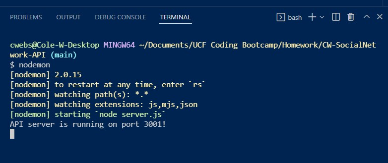

# CW-SocialNetwork-API 

- Project is currently offline with changes to my account on Atlas

## Table of Contents 
            
<a href="#description"> 1. Description</a>  

<a href="#install"> 2. Installation </a>

<a href="#contributing"> 3. Contributing </a>

<a href="#test"> 4. Screenshots </a>

## Description <h1 id='description'> </h1>

This is a project for my UCF Full Stack bootcamp. It is intended to showcase MongoDB and an API for a social media network where users can share thoughts, reactions and add friends. 
    
## Installation <h1 id='install'></h1>
          
Make sure to fork the repo, then NPM Install to run and have either Insomnia or Postman ready to test. 

View the API in action with Insomina here: [Part 1](https://drive.google.com/file/d/1IgcbehGmmtvwzVWIRipfJkIiIHOqpaWX/view) and [Part 2](https://drive.google.com/file/d/1JELxEQmDJVCOJnim5bbcRM0BLPpcIL7b/view)
    
## Contributing <h1 id='contributing'></h1>
          
If you would like to learn more about this API, please reach me at Cole.Webster@gmail.com
    
## Screenshots <h1 id='test'></h1>
         

 
